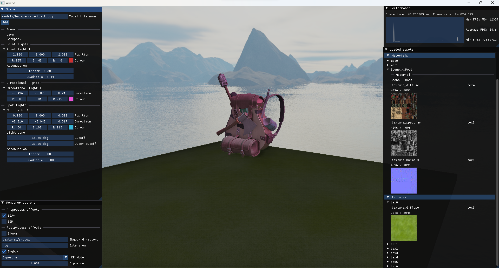

# Arrend
Arrend is my rendering project which I created alongside learning OpenGL.

## Building
All necessary headers are included. The project uses OpenGL 4.1, with GLFW3. Make sure to include the following libraries:
- glfw3
- assimp